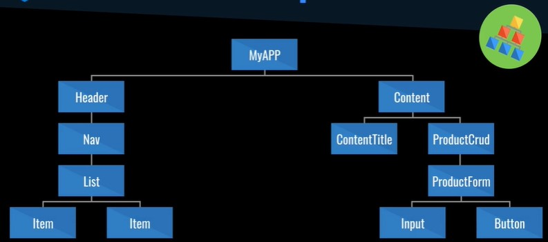
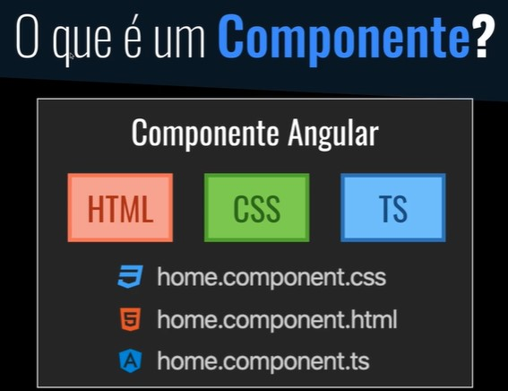

Curso de Angular 9 - Essencial realizado no site Cod3r.

### Resumo Aulas

* **Comando abaixo serve para inicializar o projeto Json com npm init**. O -y é para dar responder todas as perguntas com um valor padrão. Assim ele cria o package.json com tudo padrão
`npm init -y `

* **Criado o script Start para ele chamar o arquivo db.json** e ele ser servido como API Rest 
 `
"scripts": {
    "start": "json-server --watch db.json --port 3001"
  }
` 

* **Comando para inicializar o projeto json localmente**
`npm i json-server`

Angular é um framework desenvolvido pela Google para aplicações web SPA (Single Page Aplication) baseada em componentes e seu uso por padrão é Typescript. 

São aplicações são construidas a partir de uma árvore de componentes. Essa aplicação inicia-se pelo AppComponent que é o componente raiz, e a partir dele são referenciados outros componentes. 

O que é componente?

#### Criando APP com o Angular CLI
` npm i -g @angular/cli ` comando  para instalar angular

` ng new frontend --minimal `  Comando para criar projeto frontend 

` npm start ` Comando para iniciar o projeto  

Alterar o arquivo angular.json, passando false para as propriedades inlineTemplate e inlineStyle. Dessa forma ele não irá salvar o arquivo de html no mesmo arquivo

### Instalando Material Components
` ng add @angular/material `

### Comando para criar um componente
` ng g c components/template/header `
OU
`ng generate components/template/header `
