Curso de Angular 9 - Essencial realizado no site Cod3r.

### Resumo Aulas

* **Comando abaixo serve para inicializar o projeto Json com npm init**. O -y é para dar responder todas as perguntas com um valor padrão. Assim ele cria o package.json com tudo padrão
`npm init -y `

* **Criado o script Start para ele chamar o arquivo db.json** e ele ser servido como API Rest 
 `
"scripts": {
    "start": "json-server --watch db.json --port 3001"
  }
` 

* **Comando para inicializar o projeto json localmente**
`npm i json-server`

Angular é um framework desenvolvido pela Google para aplicações web SPA (Single Page Aplication) baseada em componentes e seu uso por padrão é Typescript. 

São aplicações são construidas a partir de uma árvore de componentes. Essa aplicação inicia-se pelo AppComponent que é o componente raiz, e a partir dele são referenciados outros componentes. 

O que é componente?

#### Criando APP com o Angular CLI
` npm i -g @angular/cli ` comando  para instalar angular

` ng new frontend --minimal `  Comando para criar projeto frontend 

` npm start ` Comando para iniciar o projeto  

Alterar o arquivo angular.json, passando false para as propriedades inlineTemplate e inlineStyle. Dessa forma ele não irá salvar o arquivo de html no mesmo arquivo

### Instalando Material Components
` ng add @angular/material `

### Comando para criar um componente
` ng g c components/template/nav ` 
OU
`ng generate components/template/header `

### Componentes Angular
* Atribute directives: altera aparência e comportamento de um elemento
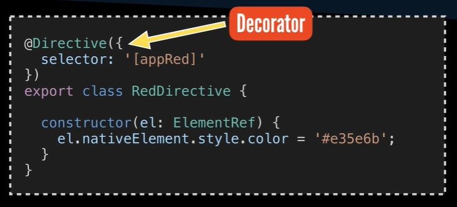
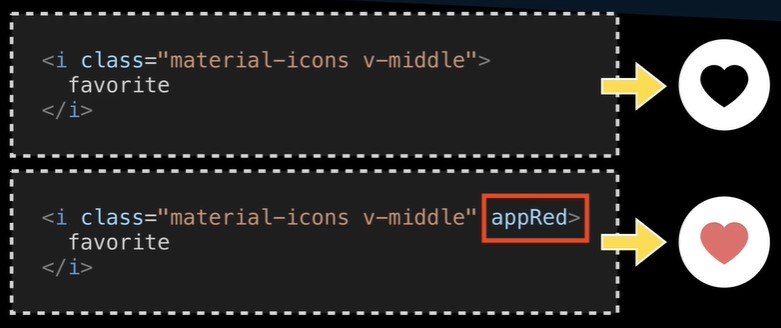

* Structural directives: altera o layout adicionando e removendo elementos da DOM. Pode ser utilizado com 
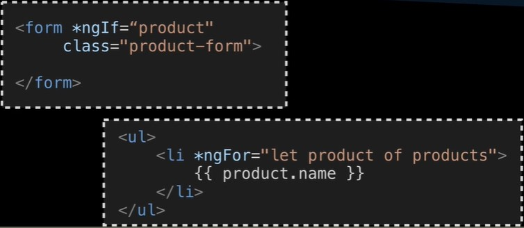

* Propertie bilding: 
* Uma das formas de fazer a comunicação entre html e ts, é com o Propertie bilding. Ele irá interpretar o que tem no [dataSource] = "products", e irá trazer o valor que foi instanciado no arquivo ts para o arquivo html. 
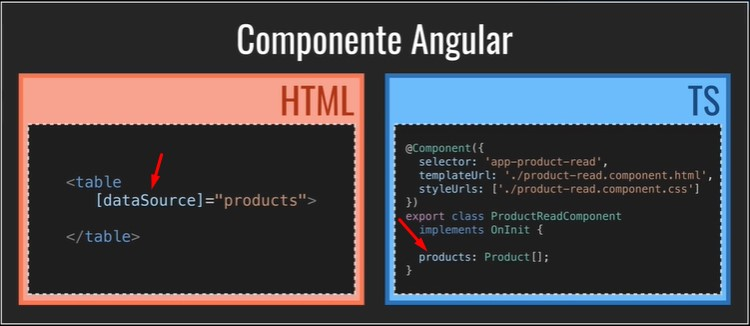

* Event bilding: 
  Como ligar um evento de html para um método que está no ts? Utilizando a mesma forma do exemplo abaixo, onde cita qual será o método utilizado no momento em que o usuário clicar no botão.
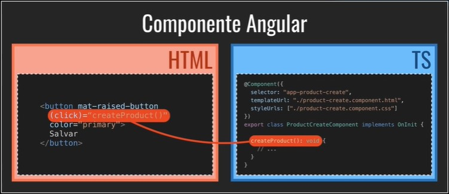

* One Way Data Bilding
Significa que se alterar no ts, ele será atualizado no arquivo html. Essa atualização funciona somente de um caminho, ts para html, e é necessário citar o value no html.

* Two Way Data Bilding
Significa que se alterar no html, ele será atualizado no arquivo ts também. Se alterar no arquivo ts, ele irá atualizar no arquivo html. São alterações de dois sentidos. Para utilizar esse modo, é usado o [(ngModel)]
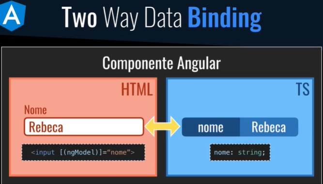

* Angular router
O componente Angular Router irá citar qual será o componente que será acessado caso clique em /home. 
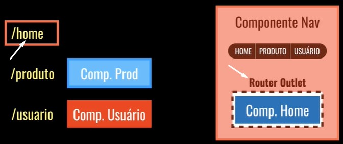
Olhando no exemplo abaixo, no routerLink é citado a rota. E em routes é citado qual a rota e componente mapeado a ele. E carregando ocomponente, ele irá jogar pra <router-outlet>. 
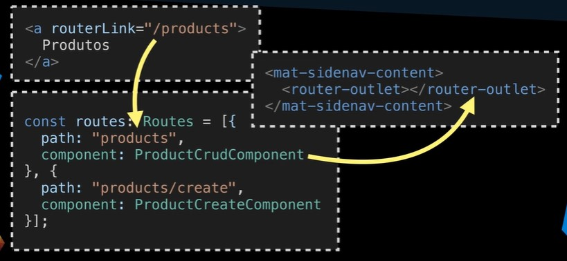

* Angular Pipes
São processamentos que são feitos em variáveis. No exemplo abaixo, tem uma interpolação em que irá interpretar o que está dentro de {{ }}. Em alguns casos queremos formatar o valor que veio do banco, nesse caso utilizados esse conceito e após a "|" citamos qual o tipo do método para formatar esse valor. 

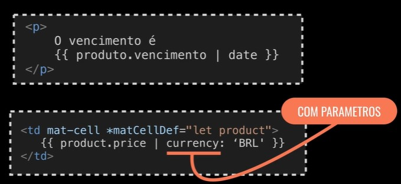
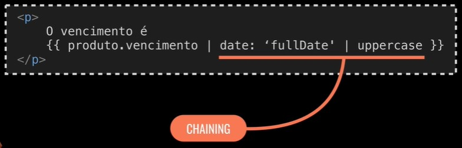

_________________________________________________
### Programação Reativa
Padrão Observer é um padrão orientado a objeto. 
No exemplo abaixo, o evento seria Compra. O intermediário que seria o Subject irá notificar os Observer interessados nesse evento. Exemplo, ao realizar uma compra, é necessário enviar email, alterar quantidade no estoque e etc... esses exemplos são serviços que precisam assumir o papel de Observer. 
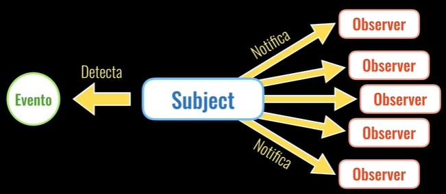
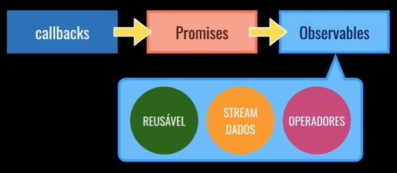
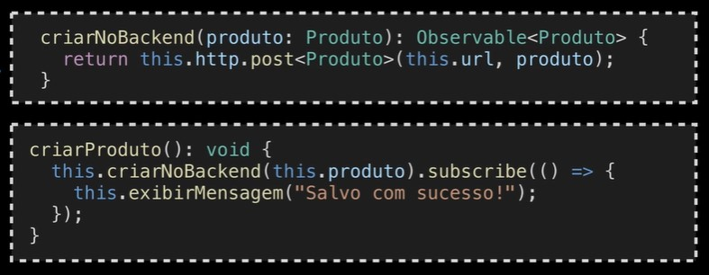

### Services
Services são classes que tem como objetivo principal organizar e compartilhar métodos e dados entre componentes. 

Para criar um componente service é utilizado o comando ` ng g s services/product ` 

A anotação @Injectable significa que é possível injetar essa classe em outros componentes.

### Injeção de Dependência
É um padrão no qual a classe recebe as dependências de uma fonte externa ao invés de criar por conta própria.

No exemplo abaixo é ilustrado um dos problemas quando não existe injeção de dependência. Se o construtor da classe Motor for alterado, a classe Carro que tinha a instância da classe Motor não é atualizada automaticamente e um erro é gerado. 
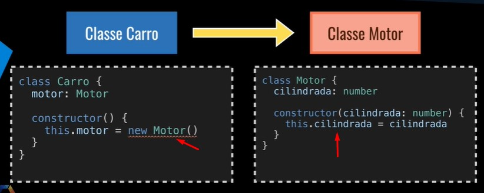

No exemplo abaixo ele cria uma dependência ao passar o Motor como parâmetro, não tendo necessidade de alterar caso a classe Motor seja modificada. 

* Services são singletons dentro do escopo de um injector.

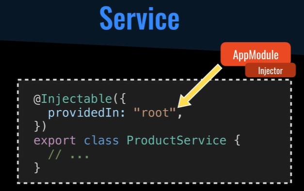

